<p align="center">

  <h1 align="center">IDEA: Inverted Text with Cooperative Deformable Aggregation for Multi-Modal Object Re-Identification</h1>

  <p align="center">
    
  <p align="center">

  <p align="center">
    <a href="https://924973292.github.io/" rel="external nofollow noopener" target="_blank"><strong>Yuhao Wang</strong></a>
    ·
    <a href="https://dblp.org/pid/51/3710-66.html" rel="external nofollow noopener" target="_blank"><strong>Yongfeng Lv</strong></a>
    ·
    <a href="https://scholar.google.com/citations?user=MfbIbuEAAAAJ&hl=zh-CN" rel="external nofollow noopener" target="_blank"><strong>Pingping Zhang*</strong></a>
    ·
    <a href="https://scholar.google.com/citations?user=D3nE0agAAAAJ&hl=zh-CN" rel="external nofollow noopener" target="_blank"><strong>Huchuan Lu</strong></a>
  </p>
<p align="center">
    <a href="https://arxiv.org/pdf/XXXX.XXXXX" rel="external nofollow noopener" target="_blank">CVPR 2025 Paper</a>
  <p align="center">
    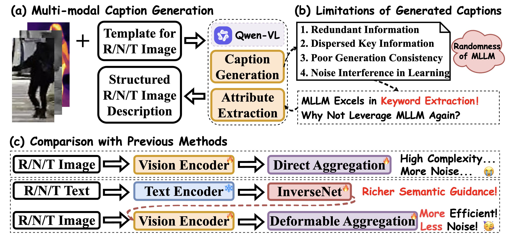
  <p align="center">
<p align="center" style="font-size: 18px; color: gray;">
    Figure 1: Motivation of IDEA.
</p>
<p align="center">
    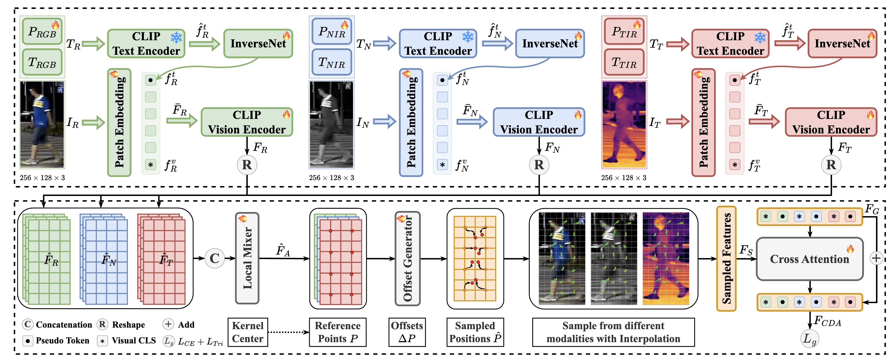
</p>
<p align="center" style="font-size: 18px; color: gray;">
    Figure 2: Overall Framework of IDEA.
</p>

## **Abstract** 📝
**IDEA** 🚀 is a novel multi-modal object Re-Identification (ReID) framework that leverages **inverted text** and **cooperative deformable aggregation** to address the challenges of complex scenarios in multi-modal imaging. By integrating semantic guidance from text annotations and adaptively aggregating discriminative local features, IDEA achieves state-of-the-art performance on multiple benchmarks.

---

## News 📢
- We released the **IDEA** codebase!
- Great news! Our paper has been accepted to **CVPR 2025**! 🏆

---

## Table of Contents 📑
- [Introduction](#introduction)
- [Contributions](#contributions)
- [Experimental Results](#experimental-results)
- [Visualizations](#visualizations)
- [Reproduction](#reproduction)
- [Citation](#citation)

---

## **Introduction** 🌟

Multi-modal object Re-IDentification (ReID) aims to retrieve specific objects by utilizing complementary information from various modalities. However, existing methods often focus solely on fusing visual features while neglecting the potential benefits of **text-based semantic information**. 

To address this issue, we propose **IDEA**, a novel feature learning framework comprising:
1. **Inverted Multi-modal Feature Extractor (IMFE)**: Integrates multi-modal features using Modal Prefixes and an InverseNet.
2. **Cooperative Deformable Aggregation (CDA)**: Adaptively aggregates discriminative local information by generating sampling positions.

Additionally, we construct three **text-enhanced multi-modal object ReID benchmarks** using a standardized pipeline for structured and concise text annotations with Multi-modal Large Language Models (MLLMs). 📝

---

## **Contributions** ✨

- Constructed three **text-enhanced multi-modal object ReID benchmarks**, providing a structured caption generation pipeline across multiple spectral modalities.
- Introduced **IDEA**, a novel feature learning framework with two key components:
  - **IMFE**: Integrates multi-modal features using Modal Prefixes and an InverseNet.
  - **CDA**: Adaptively aggregates discriminative local information.
- Validated the effectiveness of our approach through extensive experiments on three benchmark datasets.

---

## **Quick View** 📊
### Dataset Examples
#### Overview of Annotations 
<p align="center">
    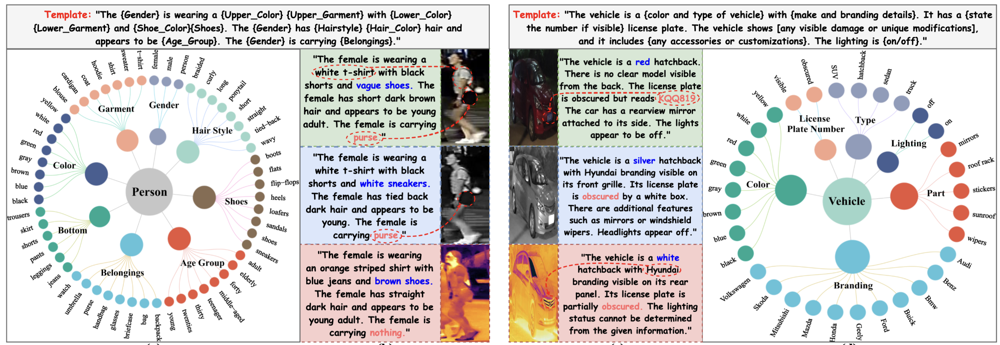
</p>

#### Multi-modal Person ReID Annotations Example
<p align="center">
    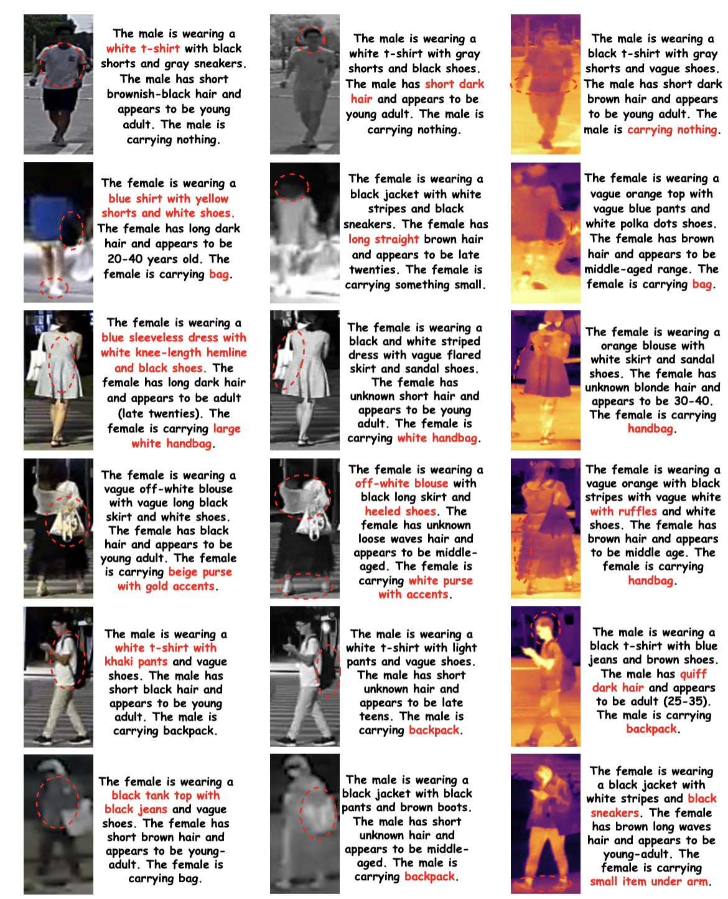
</p>

#### Multi-modal Vehicle ReID Annotations Example
<p align="center">
    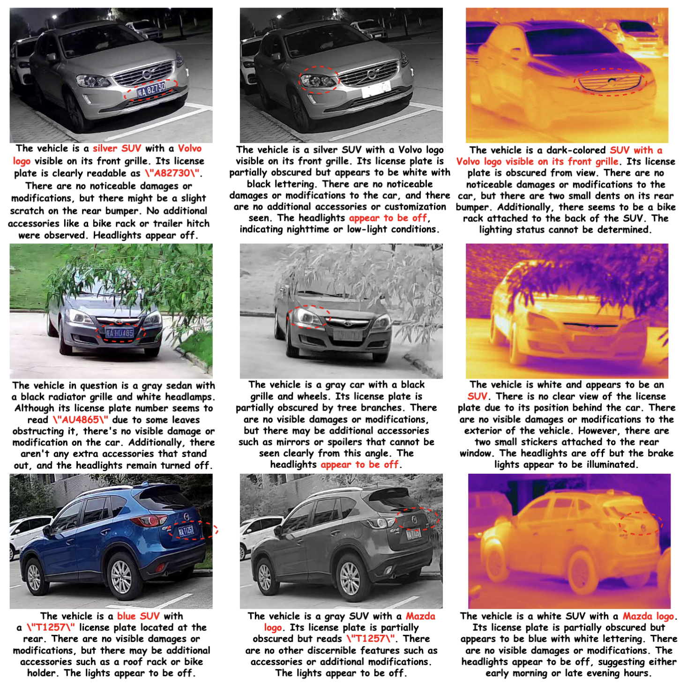
</p>

### Experimental Results
#### Multi-Modal Person ReID 
<p align="center">
  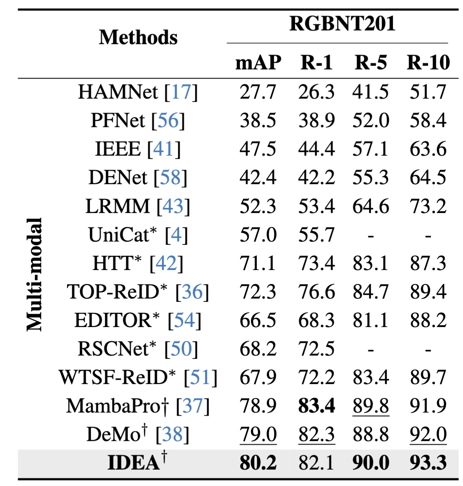
</p>

#### Multi-Modal Vehicle ReID 
<p align="center">
    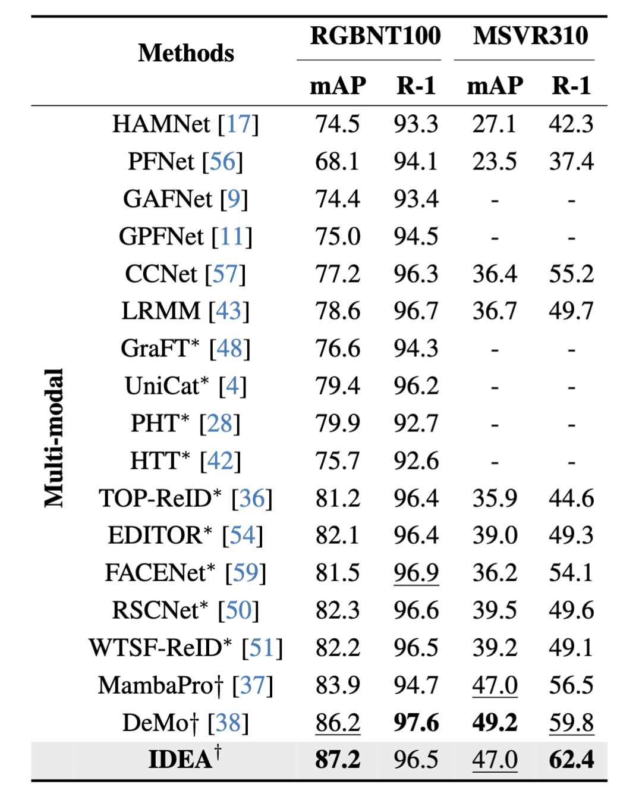
</p>

### Parameter Analysis
<p align="center">
    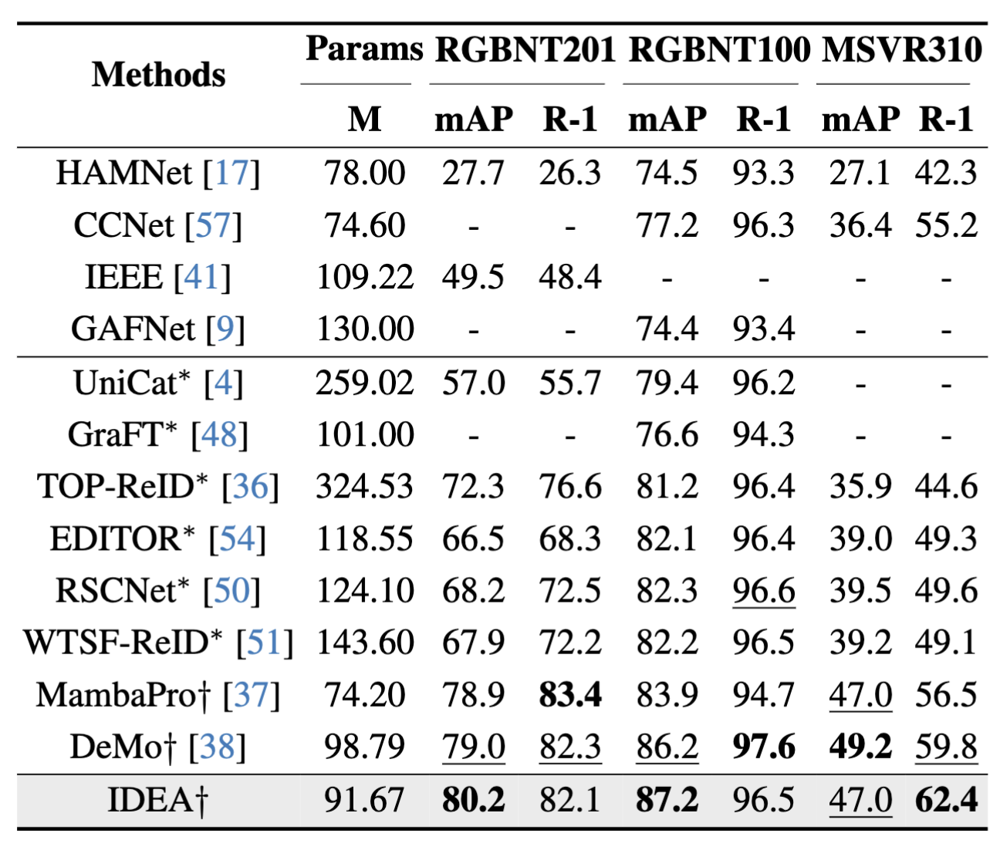
</p>

---

## **Visualizations** 🖼️

### Offsets Visualization
<p align="center">
    
</p>

### Cosine Similarity Visualization
<p align="center">
    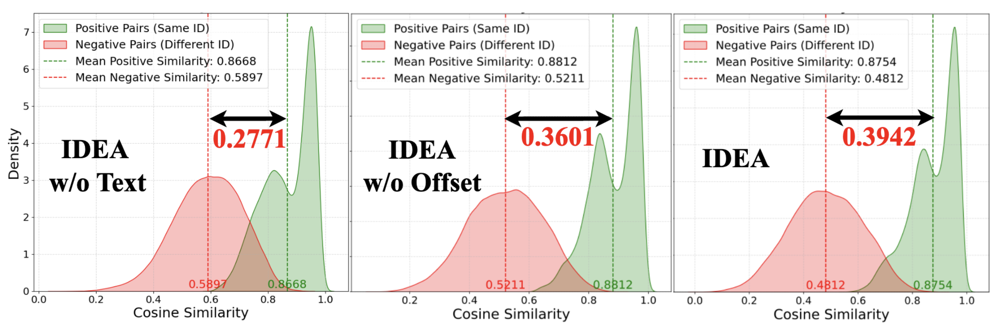
</p>

### Semantic Guidance Visualization
<p align="center">
    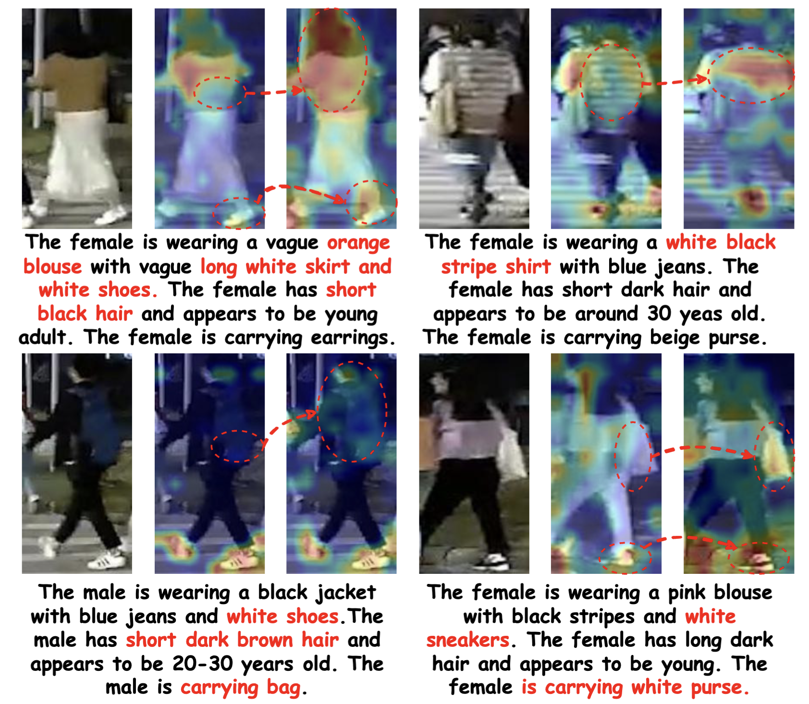
</p>

### Rank-list Visualization
#### Multi-Modal Person ReID 
<p align="center">
    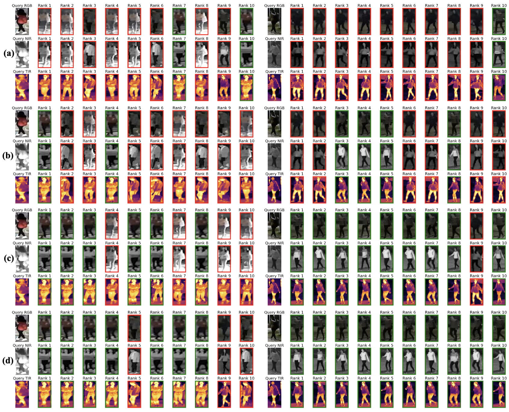
</p>

#### Multi-Modal Vehicle ReID 
<p align="center">
    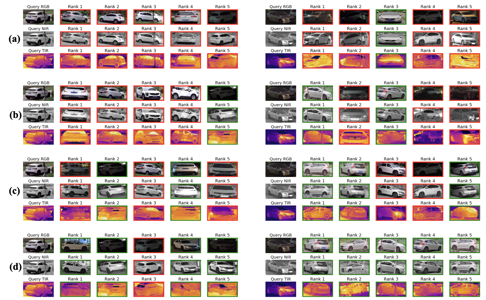
</p>

---

## **Quick Start** 🚀

### Datasets
- **RGBNT201**: [Google Drive](https://drive.google.com/drive/folders/1EscBadX-wMAT56_It5lXY-S3-b5nK1wH)  
- **RGBNT100**: [Baidu Pan](https://pan.baidu.com/s/1xqqh7N4Lctm3RcUdskG0Ug) (Code: `rjin`)  
- **MSVR310**: [Google Drive](https://drive.google.com/file/d/1IxI-fGiluPO_Ies6YjDHeTEuVYhFdYwD/view?usp=drive_link)
- **Annotations**: QwenVL_Anno

### Codebase Structure
```
IDEA_Codes
├── PTH                           # Pre-trained models
│   └── ViT-B-16.pt               # CLIP model
├── DATA                          # Dataset root directory
│   ├── RGBNT201                  # RGBNT201 dataset
│   │   ├── train_171             # Training images (171 classes)
│   │   ├── test                  # Testing images
│   │   ├── text                  # Annotations
│   │   │   ├── train_RGB.json    # Training annotations
│   │   │   ├── test_RGB.json     # Testing annotations
│   │   │   └── ...               # Other annotations
│   ├── RGBNT100                  # RGBNT100 dataset
│   └── MSVR310                   # MSVR310 dataset
├── assets                        # Github assets
├── config                        # Configuration files
├── QwenVL_Anno                   # **YOU SHOULD PUT YOUR ANNOTATIONS TO THE DATA FOLDER**
└── ...                           # Other project files
```

### Pretrained Models
- **CLIP**: [Baidu Pan](https://pan.baidu.com/s/1YPhaL0YgpI-TQ_pSzXHRKw) (Code: `52fu`)

### Configuration
- RGBNT201: `configs/RGBNT201/IDEA.yml`  
- RGBNT100: `configs/RGBNT100/IDEA.yml`  
- MSVR310: `configs/MSVR310/IDEA.yml`

### Training
```bash
conda create -n IDEA python=3.10.13
conda activate IDEA
pip install torch==2.1.1+cu118 torchvision==0.16.1+cu118 torchaudio==2.1.1+cu118 --index-url https://download.pytorch.org/whl/cu118
cd ../IDEA_PUBLIC
pip install --upgrade pip
pip install -r requirements.txt
python train.py --config_file ./configs/RGBNT201/IDEA.yml
```

## Star History 🌟

[](https://star-history.com/#924973292/IDEA&Date)

---

## **Citation** 📚

If you find **IDEA** helpful in your research, please consider citing:
```bibtex
@inproceedings{wang2025idea,
  title={IDEA: Inverted Text with Cooperative Deformable Aggregation for Multi-Modal Object Re-Identification},
  author={Wang, Yuhao and Lv, Yongfeng and Zhang, Pingping and Lu, Huchuan},
  booktitle={Proceedings of the IEEE/CVF Conference on Computer Vision and Pattern Recognition (CVPR)},
  year={2025}
}
```

---